# Recipe Manager - Veronica Chung T1A3

## Overview
Recipe Manager is a Python terminal application that helps users maintain a cookbook by storing their favourite recipes, recipes to try out, etc.

## GitHub Repository
https://github.com/chung-v/veronicachung-t1a3

## Code Style Guide
This application follows the PEP 8 style guide.
- Each indentation contains 4 spaces.
- Lines are limited to 79 characters
- Variables and functions are named in snake case (e.g. snake_case).
- Classes are named in camel case (e.g. CamelCase).
- Whitespace within parentheses, brackets, and braces is minimised.
- Import statements are on separate lines.

## System/Hardware Requirements
### Python Version
Python 3 is required to ensure compatibility with the [dependencies](#dependencies).

### Operating System
The application should run on any modern desktop operating system such as:
- Windows
- macOS
- Linux distributions (e.g. Ubuntu)

### Hardware Requirements
- Processor (CPU) - Any modern processor with one of the listed [operating systems](#operating-system).
- Memory (RAM)- 2GB or more.
- Storage - 1GB or more.

## Dependencies
The following dependencies are required to run the application:
- ```beaupy``` - For interactive selection and confirmation features.
- ```pyfiglet``` - For ASCII art fonts.
- ```rich``` - For console output formatting.
- ```os``` - For interacting with the operating system. E.g. Reading, writing and deleting files.
- ```json``` - Interface for encoding and decoding JSON formatted data.

## Installing the Application
1. Download and extract ```veronicachung-t1a3-main.zip```.
2. Open the terminal and navigate to the repository directory ```cd veronicachung-t1a3-main```.
3. Execute the bash script ```./run.sh```. Executing this file will perform the following:
    - Check if Python 3 is installed. If Python 3 is not installed, the user will see an error message ```"Python 3 is not installed. Please install Python 3 first."``` and the script will end. If it is installed, it will continue to the next step. 
    - Create a virtual environment if it does not exist.
    - Activate the virtual environment.
    - Install the [dependencies](#dependencies) from ```requirements.txt```.
    - Change directory to the folder that contains the application ```cd src```.
    - Run the [main application](#features).
    - Deactivate the virtual environment when exiting.
4. Should there be an error executing the file, enter ```chmod +x run.sh``` and then try step 3 again.

## Features
### Main Menu
When the application starts up, the user is greeted with the main menu. 

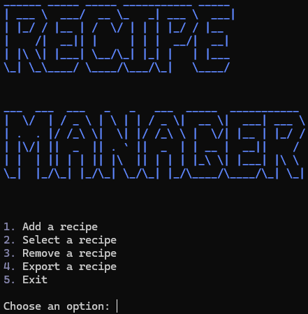

```pyfiglet``` is used to generate ASCII art for the application name ```Recipe Manager```, to ensure it stands out to the user.

One of the listed options can be selected by entering 1-5:
1. **Add a recipe** - Allows users to input details for a new recipe which includes name, cuisine, ingredients, and step-by-step instructions.
2. **Select a recipe** - Displays a list of available recipes for the user to choose from. Once selected, it shows the details of the chosen recipe, including its name, cuisine, list of ingredients, and step-by-step instructions.
3. **Remove a recipe** - Displays a list of available recipes for the user to choose from. Upon confirmation, the selected recipe is removed from the list of recipes.
4. **Export a recipe** - Prompts the user to enter the name of the recipe they want to export. If found, it creates a ```.txt``` file with the recipe details formatted nicely, including name, cuisine, ingredients, and instructions.
5. **Exit** - Terminates the application loop and exits the program.

If the user enters a value outside the intended value (1-5), an error message pops up in red: ```"Invalid choice. Please try again."```.

### 1. Add Recipe
User can store a new recipe into the application.

#### Steps
1. User inputs the following recipe details:
    - **Recipe name** - Any leading/trailing whitespace is removed.
    - **Cuisine** - Any leading/trailing whitespace is removed.
    - **Ingredients** - Ingredients are separated by commas. They are stored into an empty list with each ingredient as a separate item.
    - **Instructions** - Instructions are separated by pressing enter. They are stored into an empty list with each step as a separate item.
2. Adds the recipe to the ```RecipeManager``` instance and saves updates to ```recipes.json``` using ```save_recipe```.
3. Feedback is provided to confirm successful addition or error handling if any issues arise.

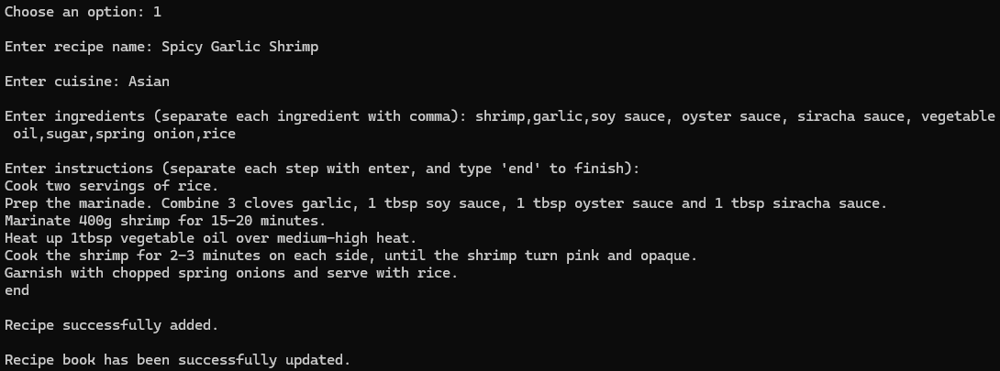

### 2. Select Recipe
Displays a list of recipes loaded in ```RecipeManager```. Allows users to view the details of a selected recipe.

#### Steps
1. User selects a recipe using interactive selection from ```beaupy``` using up and down arrow buttons.
2. Once selected, detailed information about the recipe is displayed:
    - Recipe name
    - Cuisine
    - Ingredients (listed)
    - Instructions (numbered)
3. After viewing the recipe details, the user can return to the main menu by pressing enter. The select recipe option is the only option that does not return automatically to the menu, to allow the user to read through the displayed recipe at their own pace.

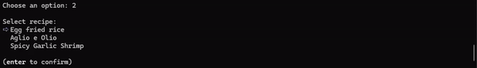
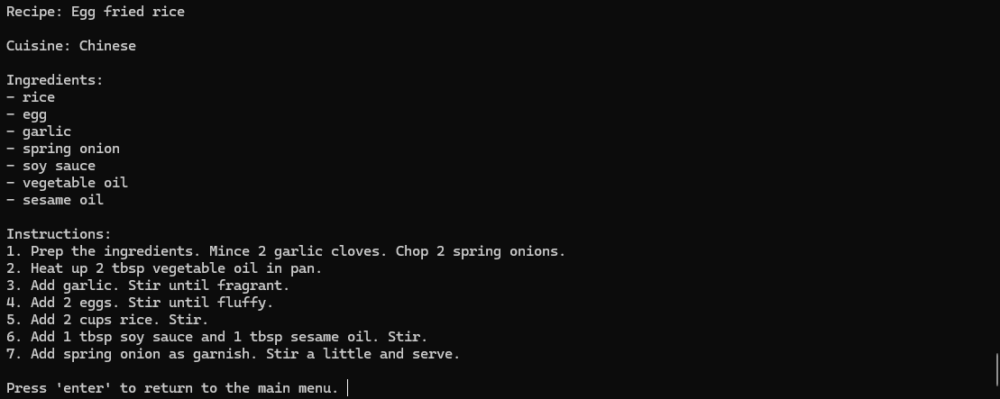

### 3. Remove Recipe
Displays a list of recipes and allows the user to select a recipe for removal.

#### Steps
1. User selects a recipe using interactive selection from ```beaupy``` using up and down arrow buttons.
2. Once selected, user confirms removal using confirm from ```beaupy```.
    - If ```yes``` is selected, the recipe is removed from ```RecipeManager```.
    - If ```no``` is selected, user is returned back to the main menu.
3. Saves updates to ```recipes.json``` using ```save_recipe```.
4. Feedback is provided to confirm successful addition or error handling if any issues arise.

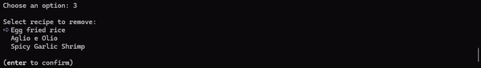
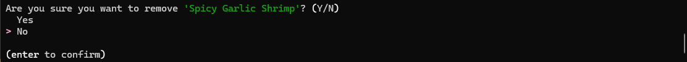

### 4. Export Recipe
Allows user to export a recipe as a ```.txt``` file.

#### Steps
1. Prompts the user to enter the name of the recipe they want to export (case insensitive).
2. Searches for the recipe with a matching name in ```self.recipes```.
3. If the file already exists, the option to overwrite the file is offered.
4. If the recipe is to be exported, a ```.txt``` file is generated in a specific format:
   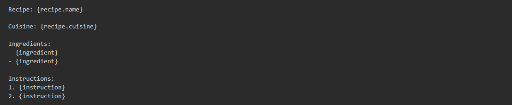
5. Provides feedback on successful export or cancellation if the user opts not to overwrite.

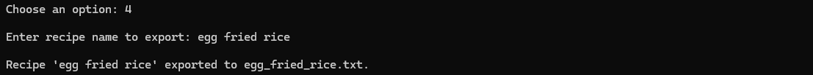
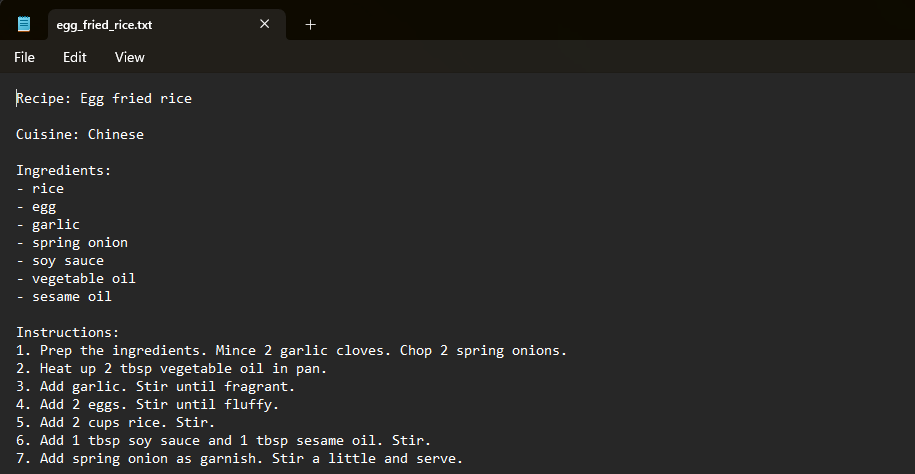

### 5. Exit
Terminates the application loop and exits the program. All active interfaces are closed and the user returns control to the command line or shell.

### Error Handling
Error messages have been styled in red using ```rich``` to emphasise the error. Red was chosen as it is commonly associated with errors, making it easier for the user to understand the issue and retry.

```if-else``` statements were used to detect error situations. When an ```if```condition identifies an error,  ```elif``` and ```else``` blocks provide an alternative path for executing code. This logic controls the flow of execution, ensuring the application can manage errors.

Additionally, exception handling using ```try``` and ```except``` blocks were used extensively throughout the code to gracefully respond to unexpected errors.

#### Example of implemented error handling code:
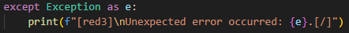

#### Example of error handling message on the console:
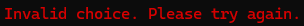

## Implementation Plan
Trello was utilised to plan the project. Each task included a checklist to ensure all aspects of the project were covered. Deadlines were determined based on the importance of the files required to run the basic application.

A snapshot of the progress made at different points in time can be seen below.

### Progress made by 27/06/24
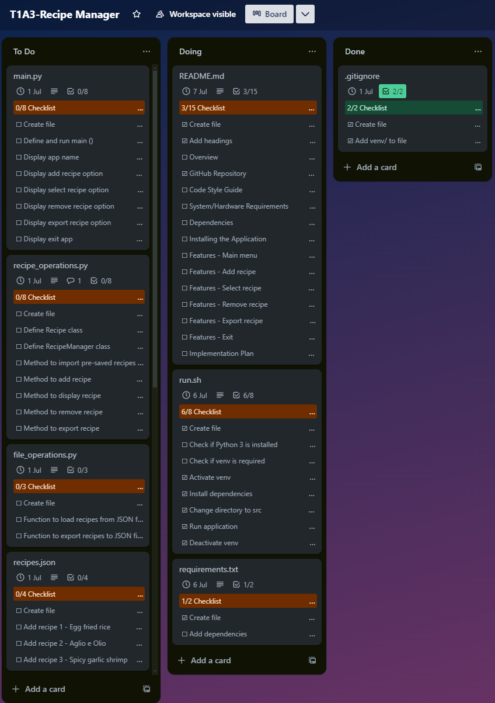
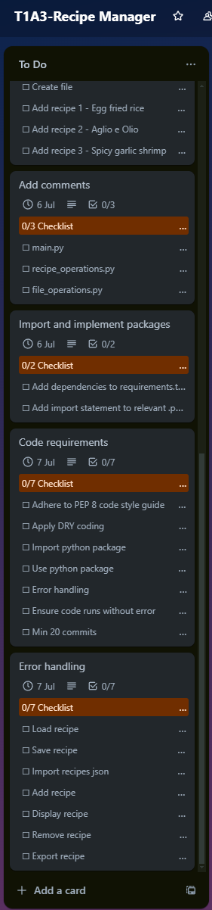

### Progress made by 01/07/24
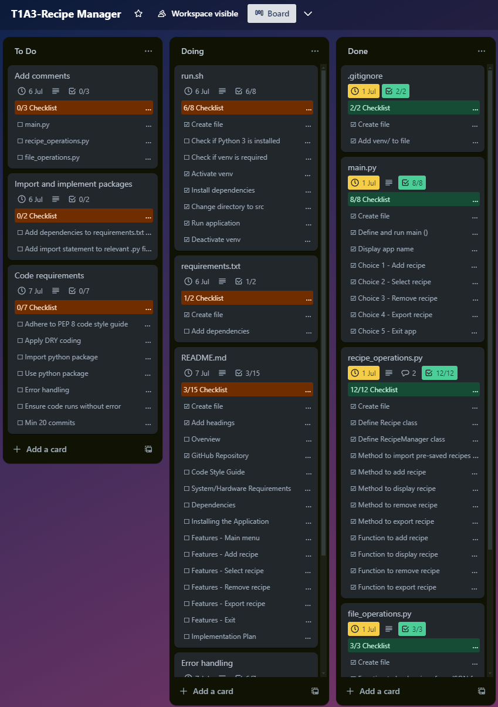
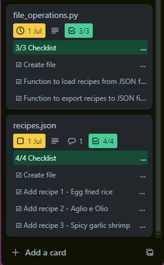
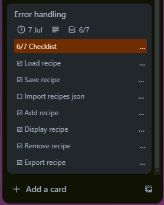

### Progress made by 07/07/24
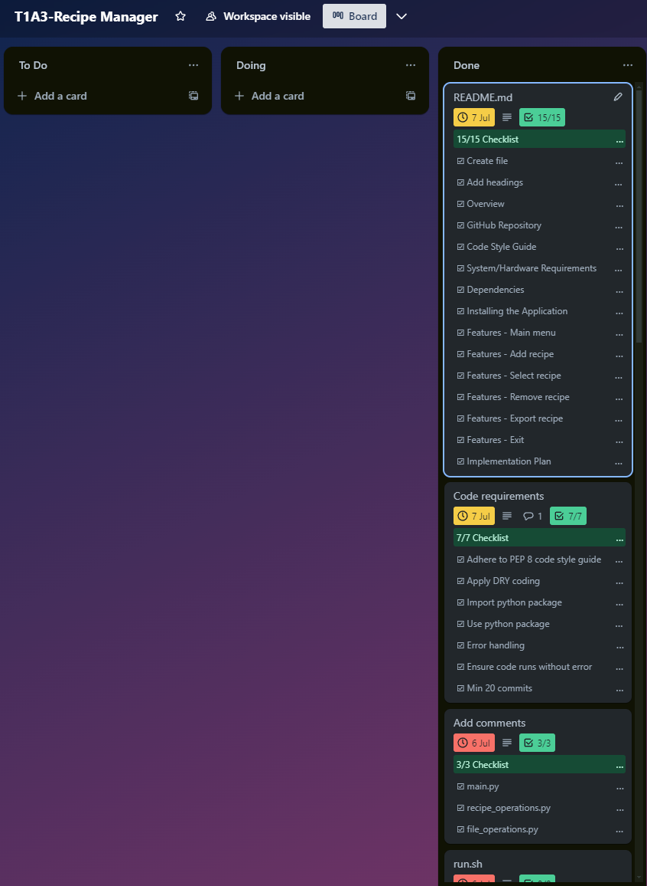

## References
- https://peps.python.org/pep-0020/
- https://pypi.org/project/beaupy/
- https://pypi.org/project/pyfiglet/
- https://pypi.org/project/rich/